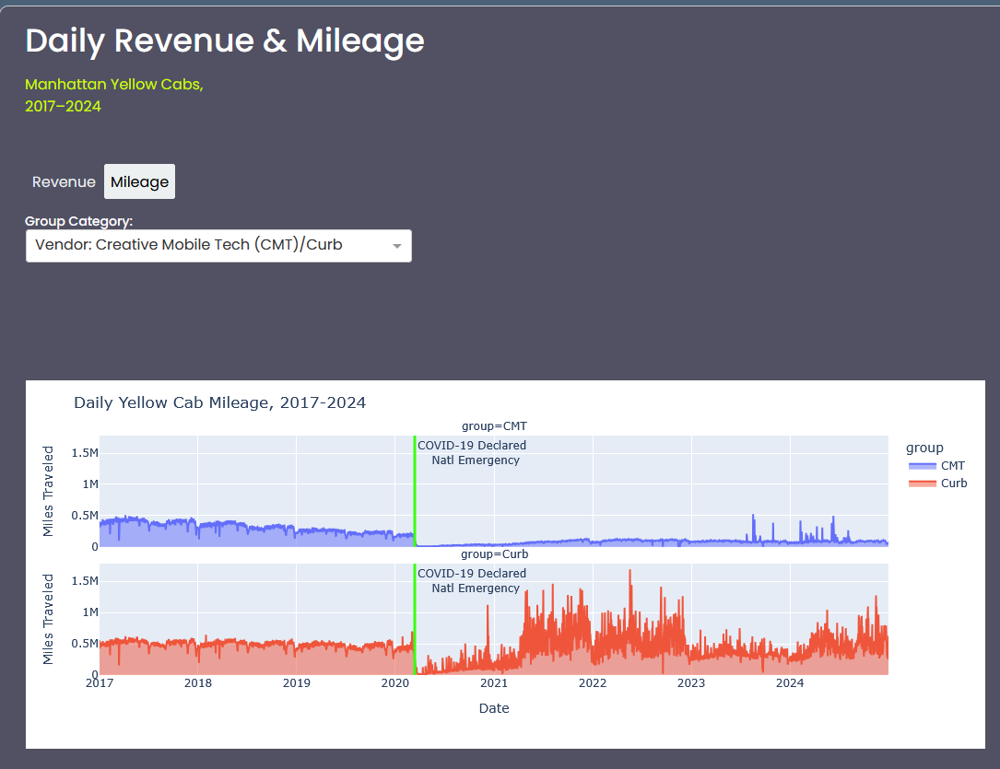

tom l / may 2025

# 🛺 NYC Yellow Cab Dashboard (2011–2024)

**🔗 Interactive Dashboard:** [tlc-trips.onrender.com](https://tlc-trips.onrender.com)

This interactive dashboard explores Manhattan yellow cab revenue 
and mileage from 2011 through 2024, using data from the NYC Taxi & Limousine Commission. 
Built with **Dash**, **Plotly**, and **Bootstrap**, the app enables users to view daily 
trends by payment type, vendor, or destination zone.

<p align="center">
  
</p>

## 🚦 Features

- 📊 Area charts with responsive layout for long time series
- 🎛 Toggle between **Revenue** and **Mileage** modes
- 🔍 Group trends by:
  - Form of Payment (Cash vs. Credit)
  - Vendor ID (Creative Mobile Tech vs. Curb)
  - Destination (In-City, Airports, Suburbs)
- 📱 Mobile-friendly horizontal scroll on small screens
- 🧠 Annotated with major industry and economic events

---

## 🧰 Tech Stack

- Python
- Dash by Plotly
- Plotly Express
- Pandas
- Bootstrap (via Dash Bootstrap Components)

---

## 📁 Project Structure

plotly_dash/
│
├── app.py
├── requirements.txt
├── preview.png
├── README.md
│
├── assets/
│   └── stylesheet.css
│
└── data/
    └── tlc_data.csv


---

## 🚀 Getting Started

### 1. Clone this repo

```bash
git clone https://github.com/your-username/plotly_dash.git
cd plotly_dash

2. Install dependencies

pip install -r requirements.txt

Or manually:

pip install dash dash-bootstrap-components pandas plotly

3. Run the app

python app.py

Then visit http://127.0.0.1:8050 in your browser.
📈 Data Notes

    Source: NYC Taxi & Limousine Commission

    Revenue data spans: 2011–2024

    Mileage data spans: 2017–2024 (pre-2017 excluded due to inconsistencies)

    Data has been summarized into a tidy daily format to improve performance and clarity.

📝 License

MIT License. Feel free to use, fork, and adapt this project with attribution.
👤 Tom Laidley / 5.17.2025
[https://linkedin.com/in/tomlaidley] [My GitHub Repository](https://github.com/laidleyt/tlc_trips)


💡 Acknowledgments

Thanks to NYC Open Data and especially the Taxi and Limo Commission for their hard work in making these data available.
Their main data page, containing download links for parquet files: https://www.nyc.gov/site/tlc/about/tlc-trip-record-data.page

To produce this CSV file, I ingested all parquet files (initially from 2009, then 2011 when it became somewhat obvious
there were some data anomalies I didn't have time to investigate--about 30GB, or about a billion rows of data) using DuckDB, 
processed and summarized the data using SQL, then exported the ~40k rows of daily summarized data to a pandas dataframe. 


